# DRAW: Deep Recurrent Attentive Writer

## Requirements
* Python 3.5.2  
* Tensorflow 1.4.0  
* Numpy 1.13.3  
* Scipy 1.2.0  
* Matplotlib 3.0.2  

## Usage
Just run the following command in the terminal.
```
$ python run.py
$ python run.py --help // for confirming the option
```

## Results

## Without attention
<div align="center">
  <div align="center">
    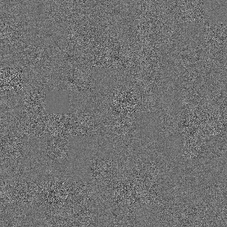
    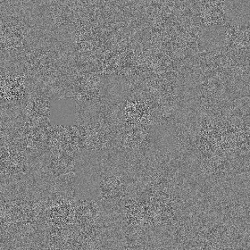
    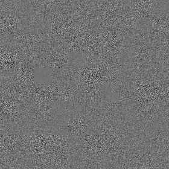
    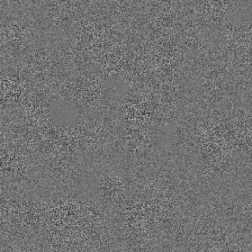
    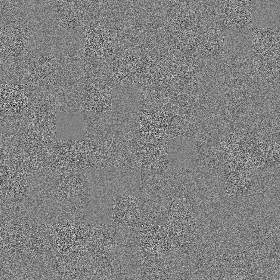</br>
    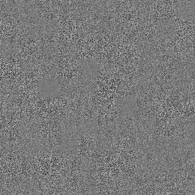
    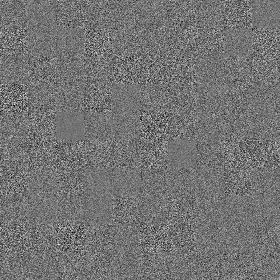
    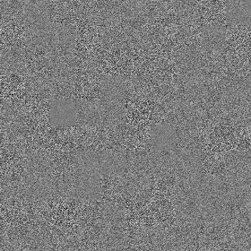
    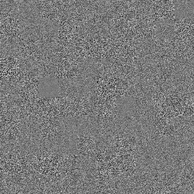
    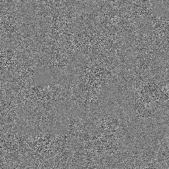
    <p>The sequentially reconstructed images at Epoch 0.</p>
  </div>
  <div align="center">
    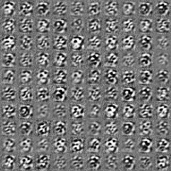
    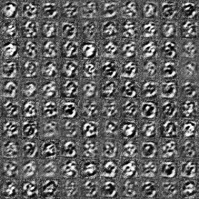
    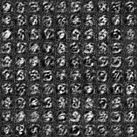
    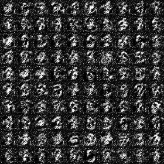
    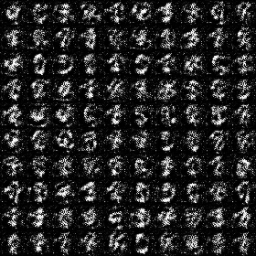</br>
    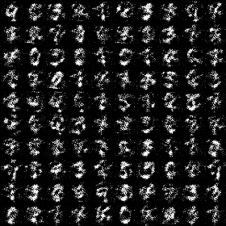
    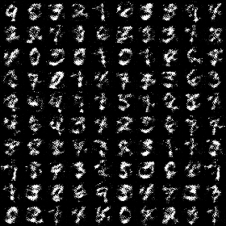
    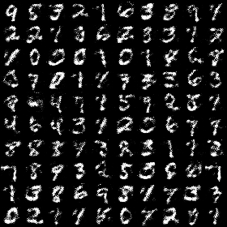
    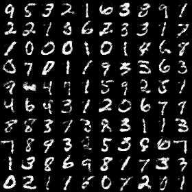
    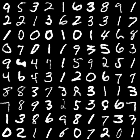
    <p>The sequentially reconstructed images at Epoch 500.</p>
  </div>
  <div align="center">
    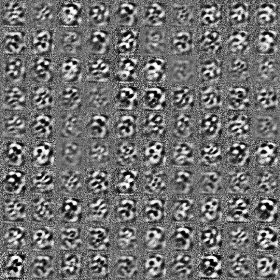
    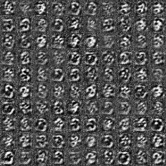
    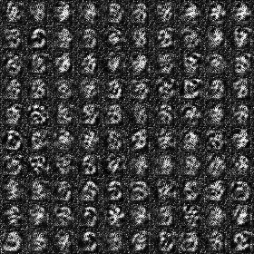
    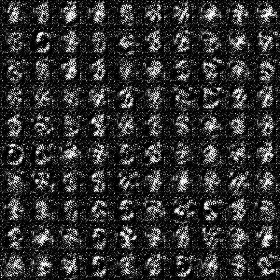
    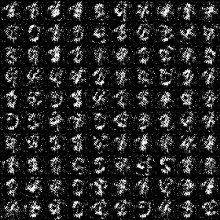</br>
    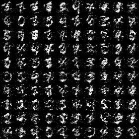
    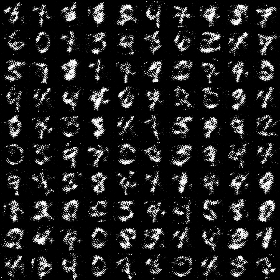
    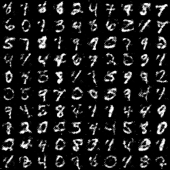
    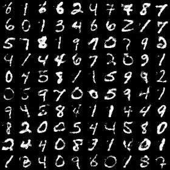
    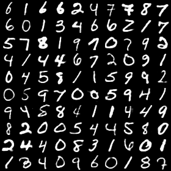
    <p>The sequentially reconstructed images at Epoch 500.</p>
  </div>
</div>

## Without attention
<div align="center">
  <div align="center">
    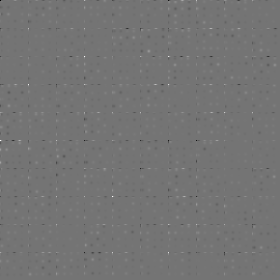
    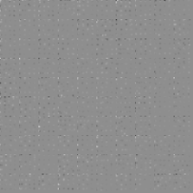
    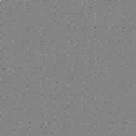
    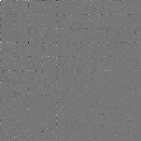
    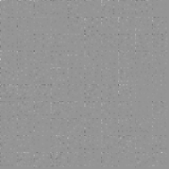</br>
    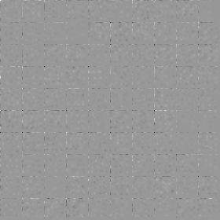
    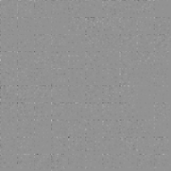
    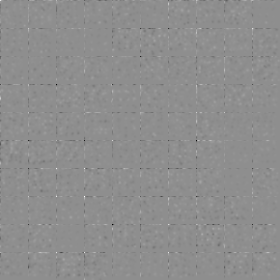
    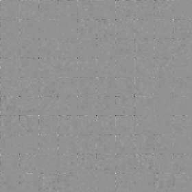
    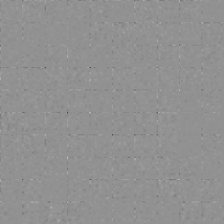
    <p>The sequentially reconstructed images at Epoch 0.</p>
  </div>
  <div align="center">
    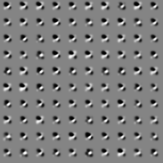
    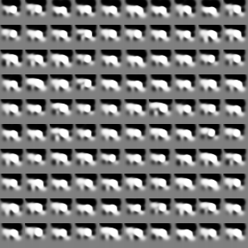
    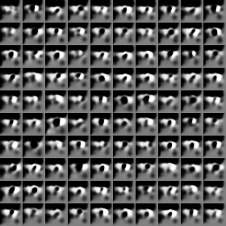
    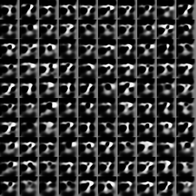
    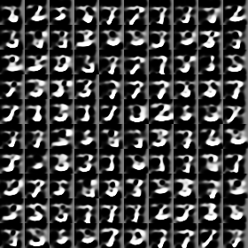</br>
    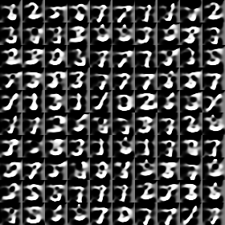
    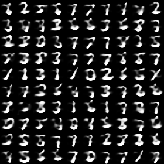
    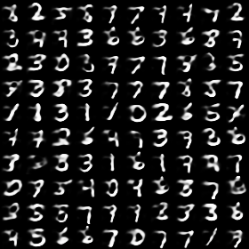
    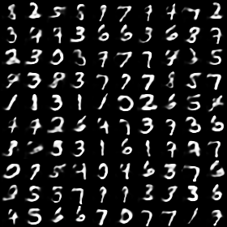
    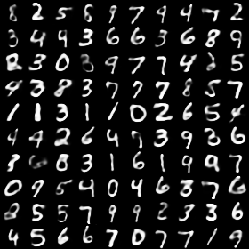
    <p>The sequentially reconstructed images at Epoch 500.</p>
  </div>
  <div align="center">
    
    
    
    
    </br>
    
    
    
    
    
    <p>The sequentially reconstructed images at Epoch 500.</p>
  </div>
</div>

## Reference
* [DRAW: Deep Recurrent Attentive Writer](https://arxiv.org/abs/1502.04623)

## Author
YeongHyeon Park
